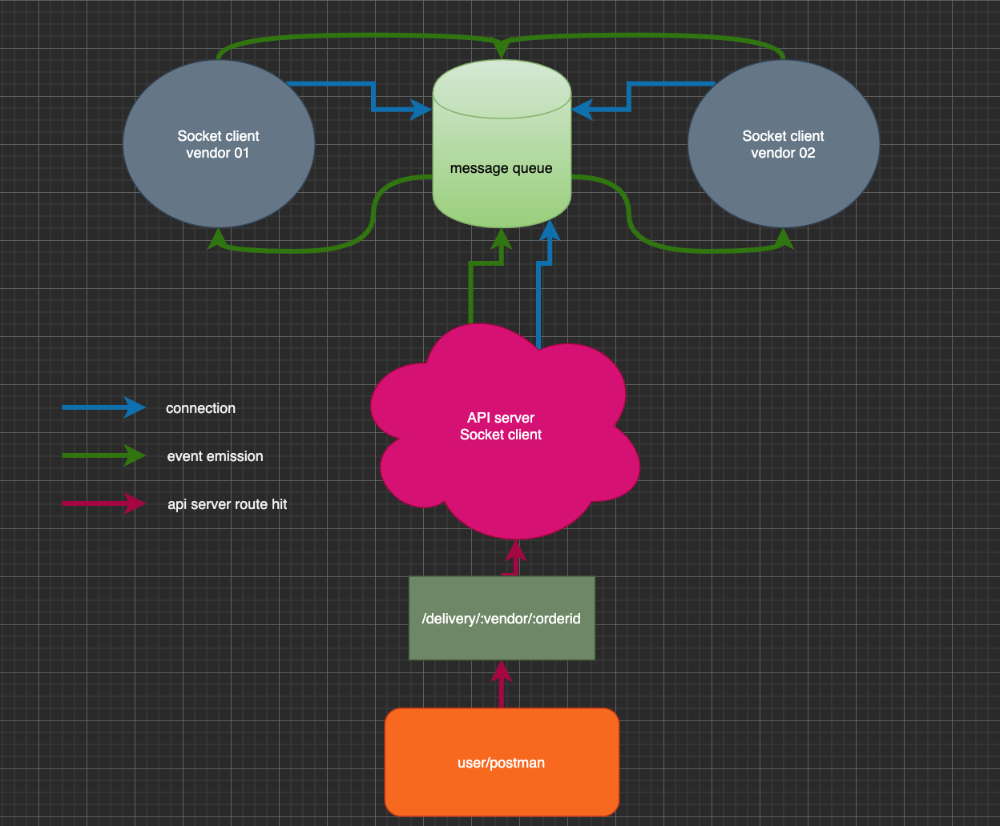

# LAB - Class 19
## Lab 19 - Message Queue
### Author: Clayton Jones

### Links and Resources  

[submission PR](https://github.com/claytonjones-401n16/lab-19/pull/1)  

### Setup  
  
#### How to initialize/run the application
Open terminal.  
Navigate to root folder  
`npm i` inside root THEN  
Open three (3) additional terminal windows  

Run each of the following commands in seperate terminals:  
  
1. `npm run start-queue`
2. `npm run start-api`
3. `npm run start-vendor-01`
4. `npm run start-vendor-02`  
  
Steps 3 and 4 are interchangable  

In Postman/Insomnia or other similar tool test the following endpoints on `http://localhost:3000`:  

* POST /delivery/flower-shop/:orderid
* POST /delivery/candy-shop/:orderid

#### Lab UML  

